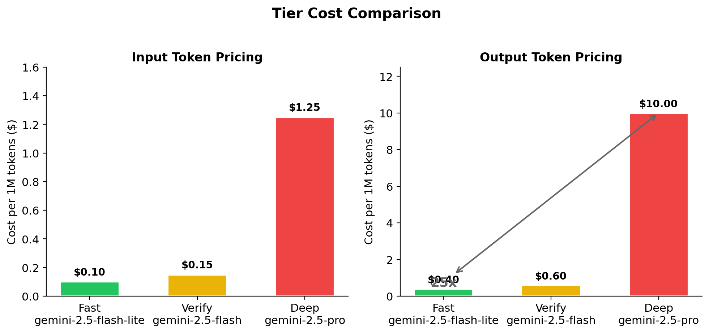
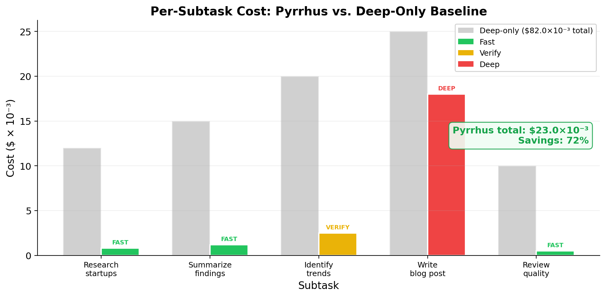

# Pyrrhus

**Budget-aware multi-agent orchestration with tiered model routing.**

Pyrrhus decomposes complex tasks into dependency graphs, routes each subtask to the cheapest model tier capable of handling it, and enforces a hard dollar budget — so you never overspend on reasoning. Named after King Pyrrhus of Epirus, whose costly victories gave us "Pyrrhic victory" — a reminder that winning at any cost is not winning at all.

> **[Read the White Paper →](WHITEPAPER.md)**

<p align="center">
  
</p>

---

## The Problem

LLM inference costs vary by **25x** across model tiers, yet most agentic systems route every subtask to the same high-capability model. A five-subtask pipeline run entirely through a frontier model costs 10–20x more than one that reserves it for only the subtasks that need it.

Pyrrhus makes **tier selection the primary budget lever** — a decision made independently for each subtask based on complexity, position in the dependency graph, and remaining budget.

## How It Works

```
User Input (task + $budget)
        │
        ▼
   ┌─────────┐     Decompose task into a DAG of subtasks
   │ Planner │     with complexity ratings (low/medium/high)
   └────┬────┘     and dependency edges
        │
        ▼
  ┌───────────┐    Map complexity → tier, estimate costs,
  │ Allocator │    downgrade if over budget
  └─────┬─────┘
        │
        ▼
  ┌───────────┐    Walk DAG in topological order, dispatch
  │ Executor  │──▶ each subtask to its assigned tier agent,
  └─────┬─────┘    track tokens, redistribute surplus
        │
        ▼
  ┌───────────┐    Score outputs via LLM-as-judge
  │ Evaluator │    (cost tracked separately from budget)
  └───────────┘
```

### Three Model Tiers

| Tier | Model | Input Cost | Output Cost | Max Tokens | Used For |
|------|-------|------------|-------------|------------|----------|
| **Fast** | gemini-2.5-flash-lite | $0.10/1M | $0.40/1M | 2,048 | Simple lookups, formatting, retrieval |
| **Verify** | gemini-2.5-flash | $0.15/1M | $0.60/1M | 4,096 | Quality checks, moderate synthesis |
| **Deep** | gemini-2.5-pro | $1.25/1M | $10.00/1M | 8,192 | Creative writing, multi-source reasoning |

<p align="center">
  
</p>

### Two Execution Strategies

**Static Allocator** — Plans tier assignments up front based on subtask complexity. If the plan exceeds budget, applies a four-pass downgrade cascade: Deep→Verify, Deep→Fast, skip low-priority Verify subtasks, then proportionally scale token caps.

**Dynamic ROI Executor** — Starts every subtask at the cheapest tier (Fast). After each generation, an LLM-as-judge scores quality. If quality < 6.0/10, the system computes the ROI of upgrading to the next tier and only upgrades when the expected quality lift per dollar is high enough (ROI ≥ 50) and budget permits.

<p align="center">
  
</p>

### Key Mechanisms

- **Budget enforcement**: hard dollar ceiling with a 4-pass downgrade cascade (never exceeded)
- **Surplus redistribution**: tokens saved by early subtasks boost downstream token caps
- **Criticality ordering**: subtasks closest to the final deliverable are downgraded last
- **Quality gates**: LLM-as-judge scoring with structured rubric (relevance, completeness, coherence, conciseness)
- **Text metrics**: deterministic analysis — type-token ratio, compression ratio, n-gram repetition, filler phrase detection

---

## Quick Start

### Prerequisites

- Python 3.10+
- Node.js 18+ (for frontend)
- A [Google AI API key](https://aistudio.google.com/apikey) (Gemini access)

### Backend

```bash
git clone https://github.com/your-org/agentic-budget-control-agents.git
cd agentic-budget-control-agents

# Create a virtual environment and install dependencies
python3 -m venv .venv
source .venv/bin/activate
pip install -r requirements.txt

# Set your API key
echo "GOOGLE_API_KEY=your-key-here" > .env
```

#### Run from CLI

```bash
# Single run with default budget ($0.08)
python main.py "Research and write a blog post about the best AI startups in 2025"

# Custom budget
python main.py --budget 0.04 "Summarize the key trends in quantum computing"

# Skip quality evaluation (faster, cheaper)
python main.py --no-eval "Write a product comparison of three CRM tools"

# Batch sweep across multiple budget levels
python main.py --batch "Research and write a blog post about AI startups in 2025"

# Custom budget levels and concurrency
python main.py --batch --budgets 0.01,0.02,0.05,0.10 --concurrency 4 "Your task here"
```

#### Run the API server

```bash
python -m dashboard.app
# API available at http://127.0.0.1:5001
```

### Frontend

```bash
cd frontend
npm install
npm run dev
# Open http://localhost:3000
```

To connect the frontend to a deployed backend, set `NEXT_PUBLIC_API_URL`:

```bash
NEXT_PUBLIC_API_URL=https://your-backend.example.com npm run dev
```

---

## Frontend Pages

| Page | Path | Description |
|------|------|-------------|
| **Home** | `/` | Task input form with budget field, pipeline overview, and example results |
| **How It Works** | `/how-it-works` | Interactive pipeline demo — enter a task and watch the DAG execute live with tier assignments and ROI decisions |
| **Compare** | `/compare` | Side-by-side Pyrrhus vs. Deep-only baseline with streaming progress, quality scores, and cost breakdown |
| **Report** | `/report` | Detailed dashboard with all 6 metric sections: budget summary, per-subtask breakdown, tier distribution, downgrade/upgrade report, efficiency stats, task graph + DAG visualization |

---

## API Endpoints

| Endpoint | Method | Description |
|----------|--------|-------------|
| `/api/run` | POST | Execute a task with budget; returns full CostReport + deliverable |
| `/api/report` | GET | Returns the latest run report |
| `/api/batch` | POST | Run a task at multiple budget levels |
| `/api/traces` | GET | List all stored run traces |
| `/api/compare/stream` | GET | SSE stream for live Pyrrhus vs. baseline comparison |
| `/api/comparisons/stats` | GET | Aggregated comparison statistics |

### Example: Run a task

```bash
curl -X POST http://127.0.0.1:5001/api/run \
  -H "Content-Type: application/json" \
  -d '{"task": "Write a competitive analysis of three CRM tools", "budget": 0.08}'
```

---

## CLI Reference

```
python main.py [OPTIONS] [TASK]

Arguments:
  TASK                    Task to execute (default: sample blog post task)

Options:
  --budget FLOAT          Dollar budget for single run (default: $0.08)
  --batch                 Run at multiple budget levels
  --budgets STRING        Comma-separated budget levels (default: 0.01,0.02,0.04,0.08,0.16)
  --no-eval               Skip quality evaluation (faster, no evaluator cost)
  --concurrency INT       Max parallel runs in batch mode (default: 3)
```

---

## Project Structure

```
├── agents/
│   ├── planner.py            # Decomposes task into subtask DAG via Gemini structured output
│   ├── allocator.py          # Routes subtasks to tiers, enforces budget via downgrade cascade
│   ├── executor.py           # Static executor — walks DAG, dispatches to tiers, tracks surplus
│   ├── dynamic_executor.py   # ROI-driven executor — starts cheap, upgrades on quality evidence
│   └── evaluator.py          # LLM-as-judge quality scoring (quick score + full evaluation)
│
├── analysis/
│   ├── trace_store.py        # Supabase persistence for run traces
│   ├── text_metrics.py       # Deterministic text quality metrics (TTR, compression, n-gram, filler)
│   └── report.py             # Batch analysis — generates plots and JSON summary
│
├── dashboard/
│   ├── app.py                # Flask API server (run, batch, traces, comparisons)
│   └── compare.py            # SSE streaming endpoint for live Pyrrhus vs. baseline comparison
│
├── frontend/                 # Next.js 16 + shadcn/ui (static export → Vercel)
│   └── src/
│       ├── app/              # Pages: home, how-it-works, compare, report
│       ├── components/       # DAG graph, live pipeline visualization
│       └── lib/              # TypeScript types mirroring Pydantic models
│
├── models.py                 # Pydantic schemas (SubTask, TaskGraph, ExecutionPlan, CostReport, ...)
├── llm_provider.py           # BudgetGeminiLLM — CAL LLM subclass with temperature + max_tokens
├── main.py                   # CLI entry point (single run + batch mode)
├── batch_runner.py           # Concurrent multi-budget sweep with shared planner
│
├── docs/
│   ├── figures/              # White paper figures (architecture, charts, flowcharts)
│   └── generate_figures.py   # Script to regenerate matplotlib charts
│
├── WHITEPAPER.md             # Full white paper with figures
├── ARCHITECTURE.md           # Detailed architecture documentation
└── requirements.txt          # Python dependencies
```

---

## Environment Variables

| Variable | Required | Default | Purpose |
|----------|----------|---------|---------|
| `GOOGLE_API_KEY` | **Yes** | — | Gemini API access for all agents |
| `BUDGET_DOLLARS` | No | `0.08` | Default budget when not specified via CLI |
| `SUPABASE_URL` | No | — | Supabase project URL for trace persistence |
| `SUPABASE_KEY` | No | — | Supabase service key |
| `NEXT_PUBLIC_API_URL` | No | `http://127.0.0.1:5001` | Frontend → backend API URL |

---

## Tech Stack

| Layer | Technology | Why |
|-------|------------|-----|
| Agent framework | [CAL](https://github.com/creevo/creevo-agent-library) | Native `@subagent`, `@tool`, `FullCompressionMemory` abstractions |
| LLM | Google Gemini (2.5-flash-lite, 2.5-flash, 2.5-pro) | Three tiers with 25x cost spread |
| Data validation | Pydantic | Typed schemas at every pipeline boundary |
| Backend | Flask + Flask-CORS | Lightweight JSON API |
| Frontend | Next.js 16, React 19, shadcn/ui, Tailwind CSS 4 | Static export, App Router |
| Persistence | Supabase (Postgres) | Trace storage and comparison analytics |

### Not Using

| Tool | Why Not |
|------|---------|
| LangChain | Adds abstraction without value — CAL gives direct control over routing and budget |
| Vector DB | No RAG component — subtask context is passed directly via prompt injection |
| Docker | Single Python backend + static frontend — no multi-service orchestration needed |

---

## Documentation

- **[White Paper](WHITEPAPER.md)** — Full technical paper with architecture diagrams, algorithm descriptions, and analysis charts
- **[Architecture](ARCHITECTURE.md)** — Detailed system design, inference flow walkthrough, output metrics specification, and design decisions

---

## License

MIT
