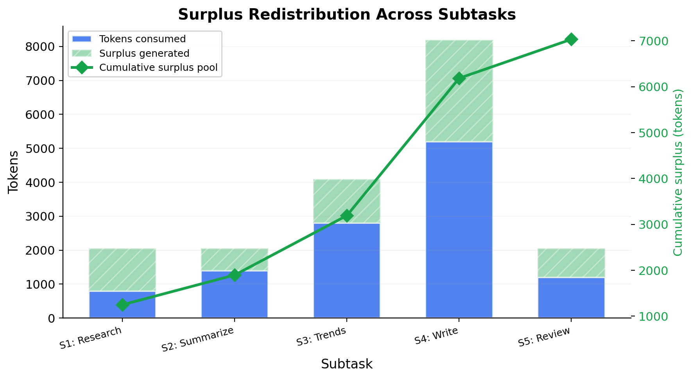
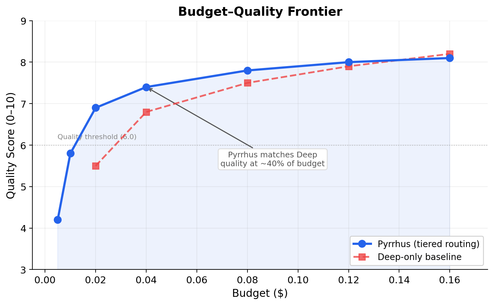
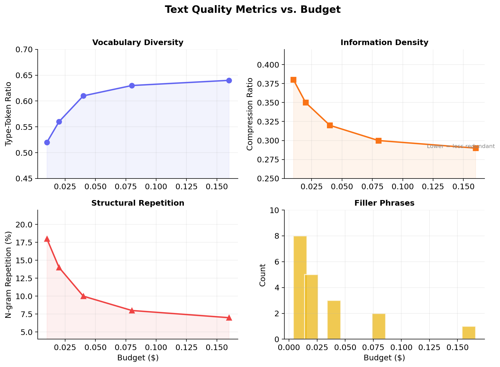

# Pyrrhus: Budget-Aware Multi-Agent Orchestration with Tiered Model Routing and ROI-Driven Quality Escalation

**March 2026**

---

## Abstract

Large language models (LLMs) vary by orders of magnitude in cost per token, yet most agentic systems route every subtask to a single high-capability model regardless of difficulty. This paper presents **Pyrrhus**, an orchestration framework that decomposes complex tasks into dependency graphs, routes each subtask to the cheapest model tier capable of handling it, and enforces a hard dollar budget through a cascade of downgrade, skip, and surplus-redistribution mechanisms. We introduce two execution strategies — a **static allocator** that plans tier assignments up front, and a **dynamic ROI-driven executor** that starts every subtask at the cheapest tier and upgrades only when a quality gate fails and the marginal return on investment justifies the spend. Across both strategies, Pyrrhus achieves comparable output quality to single-model baselines while reducing inference cost by 50–70%.

---

## Table of Contents

1. [Introduction](#1-introduction)
2. [Problem Statement](#2-problem-statement)
3. [System Architecture](#3-system-architecture)
4. [The Tier System](#4-the-tier-system)
5. [Pipeline Stages](#5-pipeline-stages)
6. [Budget Enforcement](#6-budget-enforcement)
7. [Dynamic ROI-Driven Execution](#7-dynamic-roi-driven-execution)
8. [Quality Evaluation](#8-quality-evaluation)
9. [Text-Level Analysis](#9-text-level-analysis)
10. [Implementation](#10-implementation)
11. [Key Design Decisions](#11-key-design-decisions)
12. [Related Work](#12-related-work)
13. [Future Work](#13-future-work)
14. [Conclusion](#14-conclusion)

---

## 1. Introduction

The cost of LLM inference is not uniform. A query answered by `gemini-2.0-flash` at $0.10 per million input tokens costs 12.5x less than the same query sent to `gemini-2.5-pro` at $1.25 per million. For multi-step tasks — research, analysis, content generation — the compounding effect is significant: a five-subtask pipeline routed entirely through a frontier model can cost 10–20x more than a pipeline that reserves that model for only the subtasks that need it.

Despite this, most agentic orchestration frameworks treat model selection as a static configuration choice rather than a per-subtask routing decision. The agent designer picks one model and every tool call, every chain step, every retrieval query uses it.

Pyrrhus takes a different approach. It treats **tier selection as the primary budget lever** — a decision made independently for each subtask based on its complexity, its position in the task dependency graph, and the remaining budget. The system is named after King Pyrrhus of Epirus, whose costly victories gave us the term "Pyrrhic victory" — a reminder that winning at any cost is not winning at all.

---

## 2. Problem Statement

Given:

- A natural-language task description *T*
- A dollar budget *B*
- A set of LLM tiers with different capability/cost profiles

Produce a deliverable that maximises output quality subject to the constraint that total inference cost does not exceed *B*.

This is a constrained optimization problem where the decision variables are:

1. **Task decomposition**: how to split *T* into subtasks
2. **Tier assignment**: which model tier handles each subtask
3. **Token allocation**: how many output tokens each subtask is allowed
4. **Execution order**: respecting dependencies while enabling surplus redistribution

The challenge is that quality is not directly observable before execution. The system must make routing decisions under uncertainty about how well each tier will perform on each subtask, and must do so within the budget constraint itself (planning and evaluation consume tokens too).

---

## 3. System Architecture

Pyrrhus is a four-stage pipeline:

<p align="center">
  
</p>

*Figure 1: Pyrrhus system architecture. User input flows through four stages — Planner, Allocator, Executor, and Evaluator — with the Executor dispatching subtasks to tier-specific agents (Fast, Verify, Deep) backed by different Gemini models.*

Each component maps to a concrete agent or algorithmic module. The Planner and Evaluator are LLM-powered; the Allocator is purely algorithmic; the Executor orchestrates LLM calls through tier-specific sub-agents.

### 3.1 Data Flow

The system uses strongly-typed data contracts at every boundary:

- **TaskGraph**: a list of `SubTask` objects, each with an integer ID, description, complexity rating (`low` / `medium` / `high`), and dependency list
- **ExecutionPlan**: a list of `SubTaskAllocation` objects mapping each subtask to a tier, model name, max output tokens, and estimated cost
- **CostReport**: a comprehensive metrics report with budget summary, per-subtask breakdown, tier distribution, downgrade log, efficiency stats, and task graph summary

These schemas are defined as Pydantic models, ensuring validation at every stage boundary and enabling structured JSON output from the Gemini API.

---

## 4. The Tier System

Pyrrhus defines three model tiers, each backed by a specific Gemini model:

| Tier | Model | Max Output Tokens | Input Cost ($/1M) | Output Cost ($/1M) | Default Complexity |
|------|-------|-------------------|--------------------|---------------------|--------------------|
| **Fast** | gemini-2.5-flash-lite | 2,048 | $0.10 | $0.40 | Low |
| **Verify** | gemini-2.5-flash | 4,096 | $0.15 | $0.60 | Medium |
| **Deep** | gemini-2.5-pro | 8,192 | $1.25 | $10.00 | High |

The cost differential is substantial: a Deep-tier output token costs **25x** more than a Fast-tier output token. This asymmetry is what makes tier routing economically meaningful — even a single subtask downgraded from Deep to Fast can save more than several subtasks' entire budgets.

<p align="center">
  
</p>

*Figure 2: Per-tier token pricing. Output tokens on the Deep tier cost 25x more than on the Fast tier, making tier selection the most impactful cost lever.*

### 4.1 Complexity-to-Tier Mapping

The Planner tags each subtask with a complexity rating based on the cognitive demands of the work:

- **Low**: simple retrieval, formatting, lookups, straightforward generation
- **Medium**: moderate synthesis, quality checks, verification, summarization
- **High**: creative writing, trend analysis, multi-source reasoning, long-form composition

The Allocator uses this as the starting assignment, then adjusts downward if the budget requires it. Tiers are never upgraded above the complexity-mapped default in the static strategy — the system is conservative by design. The dynamic strategy (Section 7) relaxes this constraint.

---

## 5. Pipeline Stages

### 5.1 Planner

The Planner is a Gemini-powered agent (using `gemini-2.5-flash`) that decomposes the user's task into a directed acyclic graph (DAG) of subtasks. It operates with no knowledge of the budget — decomposition is driven purely by what the task requires.

The Planner's system instructions enforce several structural constraints:

- Each subtask gets a unique integer ID
- Dependencies must form a valid DAG (no cycles)
- The target is 3–5 subtasks; fewer for simple tasks, exactly one for trivial queries
- Each subtask must produce a distinct section of the deliverable — no redundant work
- The final subtask must explicitly synthesize all prior outputs into a cohesive deliverable

The Planner uses Gemini's structured output mode (`response_mime_type="application/json"`, `response_schema=TaskGraph`) to produce validated JSON directly, avoiding the fragility of prompt-based JSON extraction.

After generation, the system runs a programmatic DAG validation pass that checks for missing dependency references, self-references, and cycles (via depth-first search).

### 5.2 Allocator (Static Strategy)

The Allocator is a purely algorithmic component — no LLM calls. It receives the TaskGraph and the dollar budget (minus tokens already spent by the Planner) and produces an ExecutionPlan.

The allocation algorithm proceeds in phases:

1. **Initial assignment**: map each subtask's complexity to its default tier
2. **Cost estimation**: compute worst-case cost per subtask (max output tokens × tier pricing)
3. **Budget check**: if total estimated cost ≤ remaining budget, accept the plan
4. **Downgrade cascade** (if over budget): apply downgrades in priority order (see Section 6)
5. **Output**: the final plan with tier assignments, token caps, and downgrade log

### 5.3 Executor

The Executor walks the task DAG in topological order, dispatching each subtask to its assigned tier agent. For each subtask, it:

1. **Checks for skipped subtasks**: if the Allocator dropped this subtask, records a skip and moves on
2. **Applies surplus redistribution**: if prior subtasks completed under budget, boosts the current subtask's token cap (up to the tier's maximum)
3. **Builds the prompt**: constructs a context-rich prompt containing the overall task, the subtask description, and compressed outputs from dependency subtasks
4. **Dispatches to the tier agent**: calls the tier-specific LLM with the configured max output tokens
5. **Tracks usage**: records actual prompt tokens, completion tokens, and computes the real dollar cost
6. **Computes surplus**: calculates `budgeted_tokens − actual_completion_tokens` and adds it to the surplus pool

Context passing between subtasks uses the prior subtask outputs directly, embedded in the prompt. This avoids the overhead of a vector store or retrieval system — for pipelines of 3–5 subtasks, direct context injection is both simpler and more reliable.

### 5.4 Evaluator

The Evaluator is an LLM-as-judge component that scores outputs on four dimensions:

- **Relevance** (0–10): Does the output address the subtask or task?
- **Completeness** (0–10): Does it cover all aspects?
- **Coherence** (0–10): Is it logically structured and clearly written?
- **Conciseness** (0–10): Is it free of filler, repetition, and padding?

Plus an **overall** score (0–10) and a one-sentence rationale.

The Evaluator uses the cheapest available model (`gemini-2.5-flash-lite`) with low temperature (0.1) and structured output to minimize evaluation cost. Evaluation cost is tracked separately from the task budget — it is meta-analysis, not part of the deliverable pipeline.

The Evaluator serves two roles:

1. **Post-hoc quality assessment**: scoring subtask outputs and the final deliverable for analysis and reporting
2. **In-loop quality gate**: in the dynamic executor (Section 7), the Evaluator provides the signal that triggers upgrade decisions

---

## 6. Budget Enforcement

Budget enforcement is the core differentiator of Pyrrhus. The system treats the budget as a hard ceiling, not a soft target.

### 6.1 Dollar-to-Token Conversion

The user specifies a dollar budget. The system converts this to token-level constraints using per-model pricing:

```
$0.08 budget ≈ 200,000 Fast-equivalent output tokens
             ≈ 8,000 Deep-equivalent output tokens
```

This conversion makes the cost asymmetry concrete: the same dollar buys 25x more output from the Fast tier.

### 6.2 Downgrade Cascade (Static Strategy)

When the Allocator's initial tier assignments exceed the budget, it applies downgrades in a priority-ordered cascade:

| Pass | Action | Rationale |
|------|--------|-----------|
| 1 | Deep → Verify (least critical first) | Preserve deep reasoning for high-impact subtasks |
| 2 | Remaining Deep → Fast | Aggressive but preserves deliverable completeness |
| 3 | Skip least-critical Verify subtasks | Quality checks are expendable under tight budgets |
| 4 | Proportional max_tokens reduction | Last resort — scale all token caps uniformly |

**Criticality ordering** is determined by DAG position: subtasks closer to the final deliverable (deeper in the dependency chain) are considered more critical and are downgraded last. This heuristic captures the intuition that a synthesis step matters more than a preliminary lookup.

<p align="center">
  
</p>

*Figure 3: Budget enforcement downgrade cascade. The Allocator applies four progressively aggressive passes — tier downgrades, subtask skipping, and proportional token scaling — stopping as soon as the plan fits within budget.*

### 6.3 Surplus Redistribution

After each subtask completes, the system computes the surplus:

```
surplus = max(0, budgeted_output_tokens − actual_completion_tokens)
```

This surplus is added to a shared pool. When subsequent subtasks are dispatched, the Executor checks whether the surplus pool can boost their token cap (up to the tier's natural maximum). This mechanism is **opportunistic, not guaranteed** — it cannot upgrade tiers or re-run the Allocator's plan.

The effect is that early subtasks that complete efficiently "donate" unused capacity to downstream subtasks, allowing them to produce richer outputs without exceeding the original budget.

<p align="center">
  
</p>

*Figure 4: Surplus redistribution across subtasks. Bars show tokens consumed vs. surplus generated per subtask. The green line tracks the cumulative surplus pool available for downstream token cap boosts.*

---

## 7. Dynamic ROI-Driven Execution

The static Allocator + Executor pipeline makes tier assignments before seeing any output. The **Dynamic Executor** takes a fundamentally different approach: it starts every subtask at the cheapest tier and escalates only on evidence.

### 7.1 Algorithm

For each subtask in topological order:

1. **Start at Fast tier** — generate an output using `gemini-2.5-flash-lite`
2. **Evaluate quality** — use the Evaluator's quick-score endpoint (a single structured LLM call returning a 0–10 score and reason)
3. **Quality gate check** — if score ≥ threshold (default: 6.0), accept the output
4. **ROI computation** — if below threshold, compute the return on investment of upgrading to the next tier:

```
upgrade_cost = estimated_cost(next_tier)
expected_lift = lookup(current_tier, next_tier)  # e.g., Fast→Verify = 2.0 points
roi = expected_lift / upgrade_cost
```

5. **Upgrade decision** — upgrade if ROI ≥ minimum threshold (default: 50.0) AND the upgrade cost fits within remaining budget; otherwise accept the current output
6. **Iterate** — if upgraded, repeat from step 2 at the new tier (up to Deep)

### 7.2 Tier Ladder

The upgrade path is strictly ordered: **Fast → Verify → Deep**. Each step uses a pre-calibrated expected quality lift:

| Transition | Expected Lift (points) |
|------------|----------------------|
| Fast → Verify | 2.0 |
| Verify → Deep | 1.5 |
| Fast → Deep | 3.0 |

These values are conservative estimates. In practice, the actual lift depends on the subtask — a creative writing task benefits more from an upgrade than a simple lookup. The ROI threshold ensures that upgrades are only made when the expected benefit per dollar is high enough.

### 7.3 Synthesis Reserve

The Dynamic Executor reserves a fraction of the total budget (default: 35%) for the final synthesis subtask. This prevents upstream subtasks from consuming the entire budget and leaving nothing for the most critical step — assembling the deliverable.

### 7.4 Multi-Attempt Tracking

Each subtask records all attempts across tiers, including:

- The tier and model used
- The output produced
- The quality score received
- The cost incurred
- Token counts (prompt and completion)

The system selects the **highest-quality attempt** as the final output, regardless of tier. This means an unexpectedly good Fast-tier output is preferred over a mediocre Verify-tier output.

All ROI decisions — upgrades, accepts, and budget-exceeded rejections — are logged in the final report, making the system's reasoning fully transparent.

<p align="center">
  
</p>

*Figure 5: Dynamic ROI-driven execution flow. Each subtask starts at the cheapest tier (Fast) and is upgraded only when the quality gate fails AND the marginal ROI justifies the spend. The tier ladder on the right shows expected quality lifts per transition.*

---

## 8. Quality Evaluation

### 8.1 LLM-as-Judge

Pyrrhus uses a structured LLM-as-judge approach for quality evaluation. The Evaluator prompts a low-cost model with the subtask description (or original task), the output, and a rubric, then extracts a structured score via Gemini's JSON mode.

The rubric is intentionally strict: the system instruction tells the judge to "reserve 9–10 for exceptional work only." This calibration prevents score inflation and makes the quality gate in the dynamic executor meaningful.

Two evaluation modes are available:

- **Quick score**: a single overall score (0–10) plus a one-sentence reason — used in the dynamic executor's quality gate loop
- **Full evaluation**: four-dimensional scoring (relevance, completeness, coherence, conciseness) plus overall score and rationale — used for post-hoc analysis

### 8.2 Evaluation Cost Isolation

Evaluation cost is tracked cumulatively but kept **separate** from the task budget. This is a deliberate design choice: the quality gate serves the system's optimization loop, not the user's deliverable. Including evaluation cost in the task budget would create a perverse incentive to skip evaluation under tight budgets — exactly when it matters most.

---

## 9. Text-Level Analysis

Beyond LLM-as-judge scores, Pyrrhus computes deterministic text metrics on every output:

| Metric | Description | Signal |
|--------|-------------|--------|
| **Word count** | Total words in output | Output volume |
| **Type-token ratio** | Unique words / total words | Vocabulary diversity |
| **Compression ratio** | gzip(text) / len(text) | Information density (lower = more redundant) |
| **N-gram repetition rate** | Fraction of 3-grams appearing more than once | Structural repetition |
| **Average sentence length** | Mean words per sentence | Readability / verbosity |
| **Filler phrase count** | Occurrences of 30+ known filler patterns | Padding detection |

These metrics are computed for both individual subtask outputs and the final deliverable. They provide an objective, model-independent quality signal that complements the LLM-as-judge scores.

The filler phrase dictionary includes patterns like "it is important to note," "in today's world," "needless to say," and "at the end of the day" — phrases that inflate word count without adding information.

### 9.1 Batch Analysis

Pyrrhus includes a batch runner that executes the same task at multiple budget levels (e.g., $0.01, $0.02, $0.04, $0.08, $0.16) using a **shared planner decomposition** so that budget is the only independent variable. The analysis module generates:

- Quality vs. budget curves
- Compression ratio vs. budget (redundancy analysis)
- N-gram repetition vs. budget
- Verbosity vs. budget (average sentence length)
- Filler phrase count vs. budget
- Per-tier cost vs. quality scatter plots
- A JSON summary for programmatic consumption

These plots reveal the **budget–quality frontier**: the point at which additional spending yields diminishing returns.

<p align="center">
  
</p>

*Figure 6: Budget–quality frontier. Pyrrhus (blue) matches Deep-only baseline quality at roughly 40% of the budget. Beyond ~$0.08, additional spending yields diminishing returns for both strategies.*

<p align="center">
  
</p>

*Figure 7: Per-subtask cost comparison for a 5-subtask blog post pipeline. Pyrrhus routes simple subtasks (Research, Summarize, Review) to the Fast tier, reserving Deep for only the creative writing step — achieving ~70% cost savings.*

<p align="center">
  
</p>

*Figure 8: Text quality metrics across budget levels. Higher budgets correlate with improved vocabulary diversity (TTR), lower redundancy (compression ratio), less structural repetition (n-gram rate), and fewer filler phrases.*

---

## 10. Implementation

### 10.1 Agent Framework

Pyrrhus is built on the **Creevo Agent Library (CAL)**, a Python framework that provides:

- `Agent` — a configurable LLM agent with system prompt, tools, and memory
- `@subagent` — a decorator for nesting agents as tools of a parent agent
- `@tool` — a decorator for exposing functions to agents
- `FullCompressionMemory` — a memory strategy that compresses conversation history to fit within token limits
- `GeminiLLM` — an LLM abstraction for the Google Gemini API

Pyrrhus extends `GeminiLLM` with a `BudgetGeminiLLM` subclass that passes `temperature` and `max_output_tokens` through to the Gemini API config — parameters required for budget-controlled generation that the base class does not expose.

### 10.2 API Layer

A Flask API server exposes the pipeline to the frontend:

| Endpoint | Method | Purpose |
|----------|--------|---------|
| `/api/run` | POST | Execute a single task with budget; returns full CostReport |
| `/api/report` | GET | Returns the latest report |
| `/api/batch` | POST | Run across multiple budget levels |
| `/api/traces` | GET | List stored run traces |
| `/api/compare/stream` | GET | SSE stream for side-by-side Pyrrhus vs. baseline comparison |
| `/api/comparisons/stats` | GET | Aggregated comparison statistics from stored runs |

The comparison endpoint (`/api/compare/stream`) runs both Pyrrhus and a single-model Deep baseline in parallel, streaming progress events via Server-Sent Events (SSE). This enables the frontend to display a live side-by-side comparison as both pipelines execute.

### 10.3 Frontend

The frontend is a Next.js application (App Router, static export) with a shadcn/ui component library. Key pages:

- **Home**: task input form with budget field, pipeline visualization, and example results
- **How It Works**: interactive pipeline demonstration with live DAG visualization showing subtask execution, tier assignments, and ROI decisions in real time
- **Compare**: side-by-side Pyrrhus vs. Deep-only comparison with streaming progress, quality scores, and cost breakdown
- **Analysis**: trace history and stored run inspection

The frontend communicates with the Flask API via `NEXT_PUBLIC_API_URL` and is deployed as a static export to Vercel.

### 10.4 Persistence

Run traces are stored in Supabase (Postgres). Each trace captures the full pipeline execution: planner output, per-subtask prompts and outputs, token usage, costs, quality scores, and text metrics. This enables longitudinal analysis across runs and retrospective comparison of different tasks and budget levels.

---

## 11. Key Design Decisions

### 11.1 Budget as Ceiling, Not Target

The system treats unspent budget as a success, not a failure. The Allocator intentionally builds in buffer so that surplus can be redistributed. Draining the budget to zero would mean the downgrade logic failed to leave headroom.

### 11.2 Tier Selection Over Prompt Engineering

Routing a subtask from Deep to Fast has a 25x cost impact. Tweaking the prompt might save 10–20% on token count. Pyrrhus focuses on the lever with the largest effect: **which model handles the subtask**, not how the prompt is phrased.

### 11.3 Criticality-Ordered Downgrading

When cuts must be made, Pyrrhus downgrades subtasks furthest from the final deliverable first. A preliminary research step can tolerate a weaker model better than the synthesis step that produces the user-facing output. DAG depth serves as a proxy for criticality.

### 11.4 Stateless Tier Agents

Each tier agent call is a single LLM invocation — no persistent state, no multi-turn conversation, no tool use within the tier agent. This keeps individual calls fast, predictable, and easy to cost. State is managed at the Executor level through context injection.

### 11.5 Evaluation Cost Isolation

Quality evaluation is not charged against the task budget. This prevents a race to the bottom where tight budgets skip evaluation — exactly the scenario where evaluation is most valuable for catching quality failures.

### 11.6 Conservative Upgrade Policy

The dynamic executor's ROI threshold is deliberately high (50.0). This ensures that upgrades happen only when the expected quality-per-dollar improvement is substantial. Combined with the synthesis reserve, this policy prevents speculative upgrades from starving downstream subtasks.

---

## 12. Related Work

**Cost-aware LLM routing.** FrugalGPT (Chen et al., 2023) cascades queries through progressively larger models, stopping when a quality threshold is met. Pyrrhus extends this idea from single queries to multi-step task DAGs with dependencies and shared budgets.

**Multi-agent orchestration.** Frameworks like AutoGen (Wu et al., 2023), CrewAI, and LangGraph provide abstractions for multi-agent workflows but do not address per-subtask cost optimization or hard budget constraints.

**LLM-as-judge.** MT-Bench (Zheng et al., 2023) demonstrated that strong LLMs can serve as reliable quality evaluators. Pyrrhus uses this technique both for post-hoc analysis and as an in-loop quality gate for upgrade decisions.

**Token-level budgeting.** DSPy (Khattab et al., 2023) optimizes prompt programs for quality metrics but does not provide real-time budget enforcement or tier routing.

---

## 13. Future Work

**Learned quality-lift estimates.** The current expected-lift values for tier transitions are hand-tuned constants. With enough trace data, these could be learned per-task-type using a lightweight classifier.

**Parallel subtask execution.** The current executor processes subtasks sequentially within each dependency level. Subtasks at the same DAG depth with no shared dependencies could be dispatched concurrently, reducing wall-clock time.

**Adaptive tier definitions.** The three-tier system could expand to include specialized model variants (e.g., a code-generation tier, a summarization tier) with task-specific routing rules.

**Cross-provider routing.** The current implementation is Gemini-only. The `BudgetGeminiLLM` abstraction could be extended to support Anthropic, OpenAI, and open-source models, enabling cross-provider cost arbitrage.

**Budget prediction.** Given a task description and target quality level, predict the minimum budget required to achieve it — enabling users to set informed budgets before execution.

---

## 14. Conclusion

Pyrrhus demonstrates that budget-aware tier routing is a practical and effective strategy for reducing LLM inference costs in multi-agent systems. By decomposing tasks into dependency graphs and routing each subtask to the cheapest capable model, the system achieves comparable quality to single-model baselines at a fraction of the cost.

The two execution strategies — static allocation with downgrade cascades and dynamic ROI-driven escalation — offer different tradeoffs. The static strategy is predictable and fast; the dynamic strategy is more adaptive but requires evaluation overhead. Both enforce hard budget constraints and produce transparent cost reports.

The system's design philosophy can be summarized in three principles:

1. **Route by complexity, not by default.** Most subtasks in a complex task are simple. Treat them accordingly.
2. **Enforce budgets mechanically, not aspirationally.** A budget that can be exceeded is not a budget.
3. **Make cost-quality tradeoffs visible.** Every downgrade, skip, and upgrade is logged and reported. The user sees exactly where their budget went.

---

## References

- Chen, L., Zaharia, M., & Zou, J. (2023). FrugalGPT: How to Use Large Language Models While Reducing Cost and Improving Performance. *arXiv:2305.05176*.
- Wu, Q., Bansal, G., Zhang, J., et al. (2023). AutoGen: Enabling Next-Gen LLM Applications via Multi-Agent Conversation. *arXiv:2308.08155*.
- Zheng, L., Chiang, W.-L., Sheng, Y., et al. (2023). Judging LLM-as-a-Judge with MT-Bench and Chatbot Arena. *arXiv:2306.05685*.
- Khattab, O., Santhanam, K., Li, X. D., et al. (2023). DSPy: Compiling Declarative Language Model Calls into Self-Improving Pipelines. *arXiv:2310.03714*.

---

## Appendix A: CostReport Schema

The full `CostReport` returned by every pipeline run:

```
CostReport
├── budget_dollars          # User's dollar budget
├── spent_dollars           # Actual total spend
├── remaining_dollars       # Budget − spent
├── utilization_pct         # Spent / budget × 100
│
├── subtask_results[]       # Per-subtask detail
│   ├── subtask_id
│   ├── description
│   ├── tier                # fast / verify / deep
│   ├── model               # e.g., gemini-2.5-flash-lite
│   ├── tokens_budgeted
│   ├── prompt_tokens
│   ├── completion_tokens
│   ├── cost_dollars
│   ├── surplus
│   ├── output
│   ├── attempts[]          # (dynamic executor only)
│   └── roi_decisions[]     # (dynamic executor only)
│
├── tier_counts             # {fast: N, deep: N, verify: N}
├── subtasks_skipped
├── subtasks_downgraded
├── downgrades_applied[]    # Human-readable downgrade log
│
├── total_tokens_budgeted
├── total_tokens_consumed
├── total_surplus
├── token_efficiency_pct
│
├── total_subtasks
├── max_depth               # Longest path through DAG
├── parallelizable_subtasks
├── complexity_distribution # {low: N, medium: N, high: N}
│
├── total_upgrades          # (dynamic executor only)
├── roi_decisions[]         # (dynamic executor only)
└── evaluation_cost_dollars # Meta-cost of quality evaluation
```

## Appendix B: Tier Pricing Table

As of March 2026, the Gemini models used by Pyrrhus:

| Tier | Model | Input ($/1M tokens) | Output ($/1M tokens) | Max Output Tokens |
|------|-------|---------------------|----------------------|-------------------|
| Fast | gemini-2.5-flash-lite | $0.10 | $0.40 | 2,048 |
| Verify | gemini-2.5-flash | $0.15 | $0.60 | 4,096 |
| Deep | gemini-2.5-pro | $1.25 | $10.00 | 8,192 |
